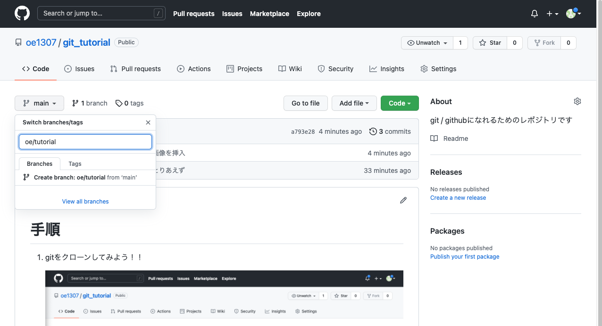

# 手順

### 1. gitをクローンしてみよう！！

cd でファイルを作りたい場所に移動


コマンド
```
git clone https://github.com/oe1307/git_tutorial.git
```


※サーバー上で行うときは

Settings -> Developer settings -> Personal access tokens
からアクセストークンを行う必要がある

詳しくは [wiki](https://github.com/oe1307/git_tutorial/wiki) で


### 2． ブランチを立てる / ブランチに移動して開発を行おう！！

githubの大元である```master(旧名:origin)```には大事なコードが集まっているので，必ずブランチを立ててそこで開発を行う





ただしブランチを立てたら，立てたブランチに移動する必要がある

コマンド
```git branch```
で今いるブランチを確認

コマンド
```git branch -r```
で立っているブランチの一覧を表示

コマンド
```git checkout <ブランチ名>```
で立てたブランチに移動


**実際にディレクトリ```tmp```に何かファイルを追加してみよう**


### 3. add / commit /push をやってみよう

まずは，gitの状態を確認

コマンド
```git status```

```Changes not staged for commit:```
もしくは
```Untracked files:```
と書かれているのが add されていないファイル

コマンド
```git add <ファイルまでのパス>``` で git に保存したいファイルを指定する


もう一度 git の状態を確認
コマンド
```git status```


git に保存したいファイルを全て選んだら commit する
commit するときはどんな変更を加えたのか分かるようにコメントを残しておく

コマンド
```git commit -m "ここにコミットコメントを入れる"```

※必ずコミットコメントは求められるので```git commit```だけでは実行できない


最後にgithubにアップロードする

コマンド
```git push```

もしくは

コマンド
```git push origin <ブランチ名>```
で github へのアップロードが行われる

実際に反映されているかgithubのページなどで確認してみよう


### 4. issue を立てる / pull requestを出してみよう!!

自分のTODOを```issues```にまとめて全体に共有する

右端の```Assignees```を自分にしておこう


開発が終わったら```pull request```を出して他の開発者にチェックを行ってもらう
他の開発者の確認が取れたら```merge```してもらえて```master```の方にも反映されます


### 5. pull してみよう！

最新の github の情報を受け取るにはpullを実行する必要がある

コマンド
```git pull```

もしくは

コマンド
```git pull origin <ブランチ名>```

で最新の github の情報を受け取る


### 6. ほかにも色々とあるので調べながら行う


### 7. ほかにもまとめておくべきものがあればお願いします

